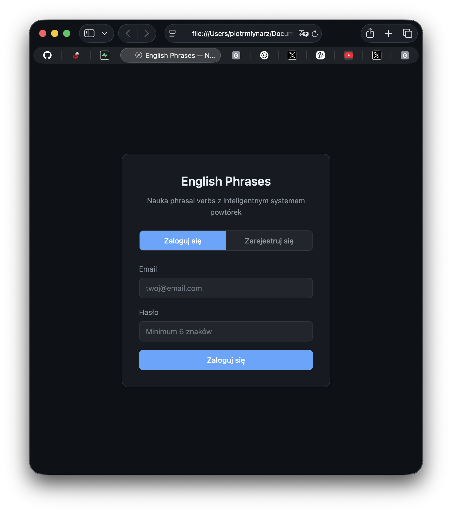
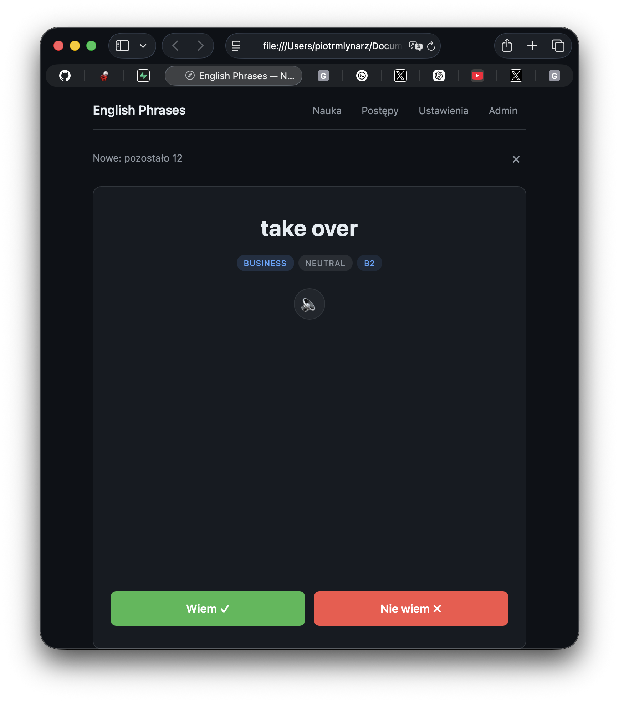
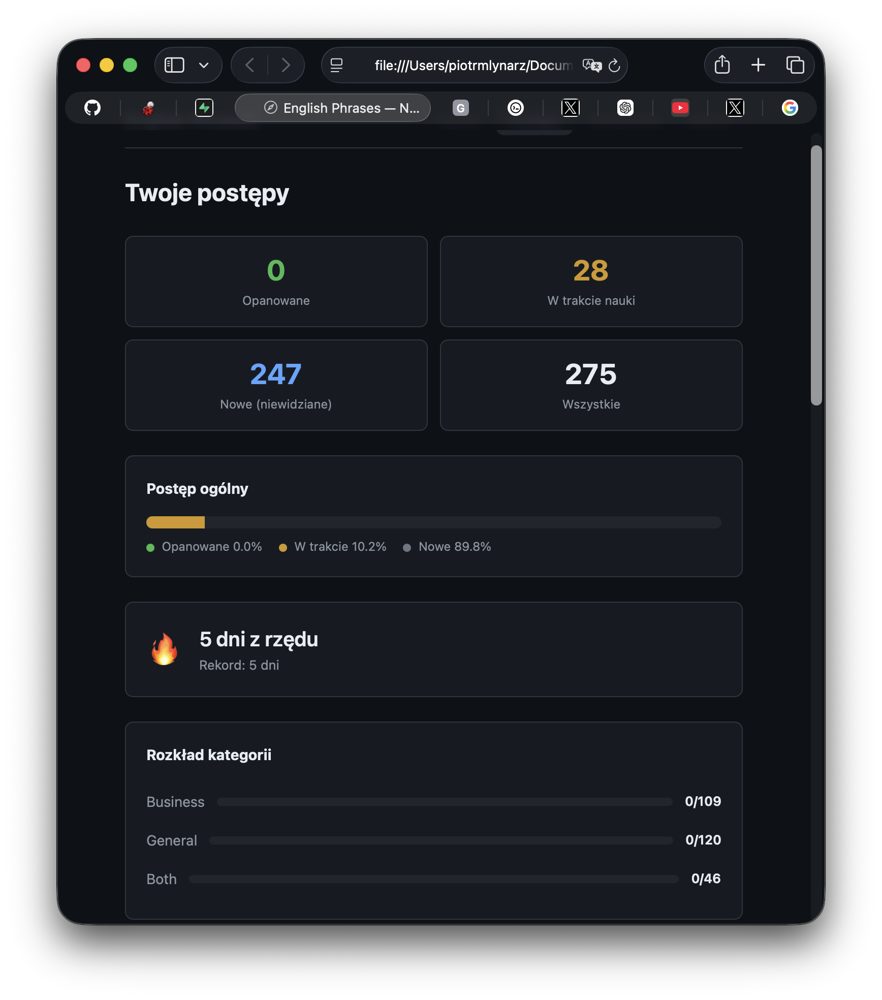
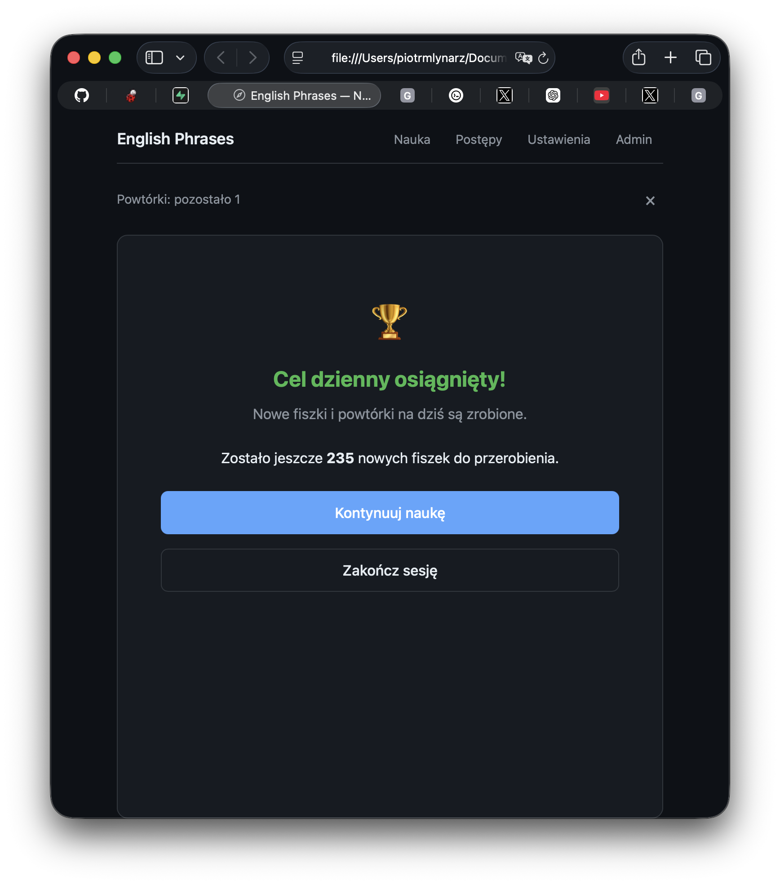

# EnglishPhrasesApp

Aplikacja webowa do nauki angielskich phrasal verbs metodą fiszek, z algorytmem inteligentnych powtórek SM-2 oraz dziennym pakietem nowych fiszek.

**[Live Demo](https://mlynarzpiotr.github.io/EnglishPhrasesApp/)**

---

## Screenshoty

| Logowanie | Fiszki |
|:---------:|:------:|
|  |  |

| Dashboard | Podsumowanie sesji |
|:---------:|:------------------:|
|  |  |

---

## Funkcje

- **Fiszki + inteligentne powtórki (SM-2)** — algorytm dobiera optymalny moment powtórki na podstawie krzywej zapominania
- **Dzienny pakiet nowych fiszek** — konfigurowalna liczba nowych phrasal verbs dziennie (domyślnie 10), kontynuowany między logowaniami tego samego dnia
- **Filtr poziomu (B2 / C1 / All)** — filtrowanie nowych fiszek po poziomie trudności; powtórki pozostają bez filtra
- **Tryb Quiz** — alternatywny tryb nauki z identyczną kolejnością i komunikatami jak w fiszkach
- **Wymowa (Web Speech API)** — odsłuchiwanie phrasal verbs i zdań przykładowych bezpośrednio w przeglądarce
- **Dashboard postępów** — statystyki ogólne, historia sesji agregowana dziennie, najtrudniejsze phrasal verbs
- **Sekcja "Jak działa nauka?"** — zwijany panel na ekranie głównym wyjaśniający algorytm SM-2 w prostych słowach
- **Panel admina** — zatwierdzanie nowych użytkowników, przegląd aktywnych kont
- **Streak tracking** — śledzenie serii dni nauki (aktualna i najdłuższa seria)
- **275 phrasal verbs** — bogata baza z kategoriami (business / general), tagami tematycznymi, 4 zdaniami przykładowymi każdy

---

## Jak działa algorytm SM-2

Aplikacja korzysta z algorytmu SM-2 (SuperMemo 2) — sprawdzonego systemu powtórek opartego na krzywej zapominania Ebbinghausa. Każda fiszka ma swój współczynnik łatwości (`ease_factor`): odpowiedź "wiem" przesuwa ją do rzadszych powtórek, a "nie wiem" resetuje serię i wraca do powtórki następnego dnia. Dzięki temu phrasal verbs, które sprawiają ci kłopot, pojawiają się częściej, a te opanowane — coraz rzadziej.

Szczegółowe wyjaśnienie z przykładami: [docs/jak-dziala-sm2.md](docs/jak-dziala-sm2.md)

---

## Stack technologiczny

| Warstwa | Technologia | Opis |
|---------|------------|------|
| Frontend | HTML, CSS, vanilla JavaScript | Bez frameworków, bez bundlera, bez npm |
| Hosting | GitHub Pages | Darmowy hosting statycznych plików |
| Baza danych | Supabase (free tier) | PostgreSQL w chmurze z REST API |
| Autoryzacja | Supabase Auth | Email + hasło, system zatwierdzania kont |
| Wymowa | Web Speech API | Wbudowana w przeglądarkę, zero zależności |
| SDK | Supabase JS (CDN) | Ładowany z CDN, brak lokalnych zależności |

**Zasada projektu**: brak frameworków, brak zależności npm, brak procesu budowania. Całość jako pliki HTML/CSS/JS serwowane przez GitHub Pages.

---

## Uruchomienie

### 1. Supabase — konfiguracja projektu

1. Załóż darmowe konto na [supabase.com](https://supabase.com)
2. Utwórz nowy projekt
3. W ustawieniach projektu włącz **Email provider** w sekcji Authentication

### 2. Baza danych — uruchomienie SQL

W **SQL Editor** w Supabase uruchom pliki SQL w następującej kolejności:

| Kolejność | Plik | Opis |
|:---------:|------|------|
| 1 | `sql/001_create_tables.sql` | Tabele, RLS, trigger rejestracji |
| 2 | `sql/002_import_phrasal_verbs_part1.sql` | Import phrasal verbs (część 1/6) |
| 3 | `sql/002_import_phrasal_verbs_part2.sql` | Import phrasal verbs (część 2/6) |
| 4 | `sql/002_import_phrasal_verbs_part3.sql` | Import phrasal verbs (część 3/6) |
| 5 | `sql/002_import_phrasal_verbs_part4.sql` | Import phrasal verbs (część 4/6) |
| 6 | `sql/002_import_phrasal_verbs_part5.sql` | Import phrasal verbs (część 5/6) |
| 7 | `sql/002_import_phrasal_verbs_part6.sql` | Import phrasal verbs (część 6/6) |
| 8 | `sql/003_fix_admin_policies.sql` | Poprawki polityk RLS dla admina |
| 9 | `sql/004_update_phrasal_verbs_200_275.sql` | Aktualizacja jakości phrasal verbs 200-275 |
| 10 | `sql/005_add_first_seen_on.sql` | Migracja: kolumna `first_seen_on` |
| 11 | `sql/006_add_difficulty_filter.sql` | Migracja: filtr poziomu trudności |

### 3. Klucze API

W pliku `js/supabase.js` ustaw swoje klucze:

```javascript
const SUPABASE_URL = 'https://twoj-projekt.supabase.co';
const SUPABASE_ANON_KEY = 'twoj-anon-key';
```

Klucze znajdziesz w Supabase: **Settings → API → Project URL** i **anon/public key**.

### 4. Uruchomienie lokalne

Otwórz `index.html` w przeglądarce. Aplikacja nie wymaga serwera deweloperskiego — działa jako statyczne pliki.

### 5. Konto admina

Po pierwszej rejestracji, ręcznie ustaw swoje konto jako admina w Supabase:

```sql
UPDATE profiles SET role = 'admin', approved = true WHERE email = 'twoj@email.com';
```

### 6. Deploy na GitHub Pages

1. Utwórz repozytorium na GitHub i wypchnij kod
2. **Settings → Pages → Source**: main branch, root (`/`)
3. Aplikacja będzie dostępna pod `https://[username].github.io/[repo-name]/`

---

## Struktura projektu

```
EnglishPhrasesApp/
├── index.html                ← Główna aplikacja (SPA)
├── update_supabase.html      ← Narzędzie do aktualizacji danych w Supabase
├── css/
│   └── styles.css            ← Wszystkie style (ciemny motyw, responsive)
├── js/
│   ├── app.js                ← Inicjalizacja, routing, nawigacja
│   ├── auth.js               ← Logowanie, rejestracja, zarządzanie sesją
│   ├── supabase.js           ← Klient Supabase, konfiguracja
│   ├── flashcards.js         ← Logika fiszek, prezentacja phrasal verbs
│   ├── quiz.js               ← Tryb quiz
│   ├── sm2.js                ← Algorytm SM-2 (powtórki)
│   ├── dashboard.js          ← Dashboard, statystyki
│   ├── admin.js              ← Panel admina
│   ├── settings.js           ← Ustawienia użytkownika
│   ├── speech.js             ← Wymowa (Web Speech API)
│   └── session.js            ← Podsumowanie sesji, tracking czasu
├── data/
│   └── phrasal-verbs.json    ← Seed data (do importu do Supabase)
├── sql/
│   ├── 001_create_tables.sql
│   ├── 002_import_phrasal_verbs_part[1-6].sql
│   ├── 003_fix_admin_policies.sql
│   ├── 004_update_phrasal_verbs_200_275.sql
│   ├── 005_add_first_seen_on.sql
│   └── 006_add_difficulty_filter.sql
├── docs/
│   ├── jak-dziala-sm2.md     ← Szczegółowe wyjaśnienie algorytmu SM-2
│   └── screenshots/          ← Screenshoty aplikacji
├── INSTRUKCJE.md             ← Pełna specyfikacja techniczna projektu
├── TODO.md                   ← Lista zadań i plan rozwoju
└── DEPLOY_INSTRUCTIONS.md    ← Instrukcje deploymentu
```

---

## Baza danych

Aplikacja korzysta z 5 tabel w Supabase (PostgreSQL):

| Tabela | Opis |
|--------|------|
| `profiles` | Rozszerzenie `auth.users` — rola, status zatwierdzenia, dzienny cel, filtr poziomu |
| `phrasal_verbs` | 275 phrasal verbs z definicjami, tłumaczeniami, kategoriami i 4 zdaniami przykładowymi |
| `user_progress` | Postępy użytkownika per phrasal verb — parametry SM-2, statystyki odpowiedzi |
| `session_log` | Historia sesji nauki — data, wyniki, czas trwania |
| `streaks` | Serie dni nauki — aktualna i najdłuższa seria |

Wszystkie tabele mają włączone **Row Level Security (RLS)** — użytkownik ma dostęp tylko do swoich danych.

Pełny opis struktury tabel: [INSTRUKCJE.md — sekcja 4](INSTRUKCJE.md#4-baza-danych--struktura-supabase)

---

## Dzienny pakiet — jak działa

1. **Nowe (pakiet dzienny)** — liczba nowych = `daily_goal` z ustawień
2. **Powtórki zaległe** — wszystko, co ma `next_review <= teraz`
3. **Reszta nowych (opcjonalnie)** — po komunikacie "Cel dzienny osiągnięty!"

Nowe fiszki są losowane stabilnie **per dzień**, więc przy kolejnym logowaniu zobaczysz pozostałe "brakujące" nowe, a nie inne.

Filtr poziomu (B2/C1/All) dotyczy tylko nowych fiszek — powtórki zawsze się pojawiają.

---

## Checklist testów manualnych

- Logowanie/rejestracja, konto czeka na zatwierdzenie, zatwierdzenie admina.
- `daily_goal=12`, pierwsze logowanie → 12 nowych, potem powtórki.
- W trakcie dnia: zrób 6 nowych, wyloguj → po ponownym logowaniu start od pozostałych 6 nowych.
- Po ukończeniu nowych + powtórek: komunikat "Cel dzienny osiągnięty!" z wyborem "Kontynuuj/Zakończ".
- Po "Kontynuuj": brak licznika w nagłówku, doładowywanie kolejnych nowych.
- Zmiana `daily_goal` w trakcie dnia działa od razu.
- Przejście przez północ: sesja rozpoczęta przed północą zachowuje pakiet dnia startu.
- Quiz: identyczna kolejność i komunikaty jak w fiszkach.
- Dashboard: historia sesji agregowana dziennie.

---

## Autor

**Piotr Młynarz** — [GitHub](https://github.com/mlynarzpiotr)
